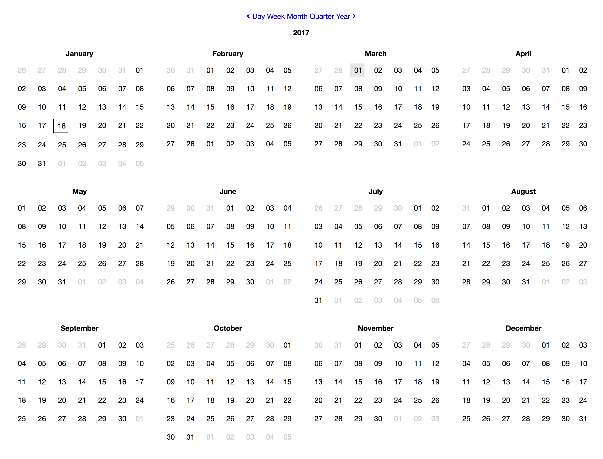
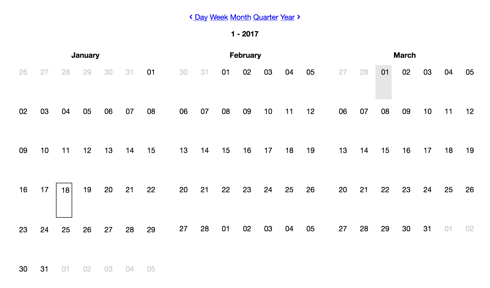
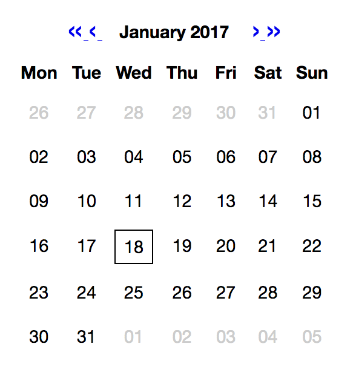

# Introduction

_Calendar_ provides calendar views. Currently two modes are available:
* **Month View**
    * Displays a single month
    * Initially the current month is shown
    * allows to browse month (if enabled in configuration)
* **Combo View**
   * Displays different periods: Year, month, quarter, week or day
   * Initially the current period is displayed
   * allows to switch between periods (in enabled in configuration)
   * displays calendar items
   
Both views are used by inserting a [Calender ViewHelper](./ViewHelpers/Widget/CalendarViewHelper.md) into a fluid template.

# Examples

